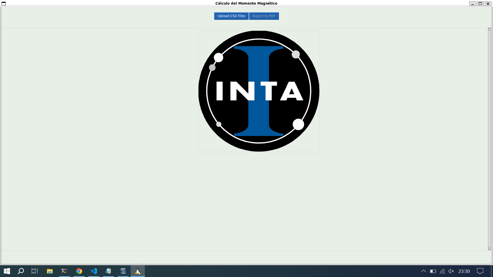
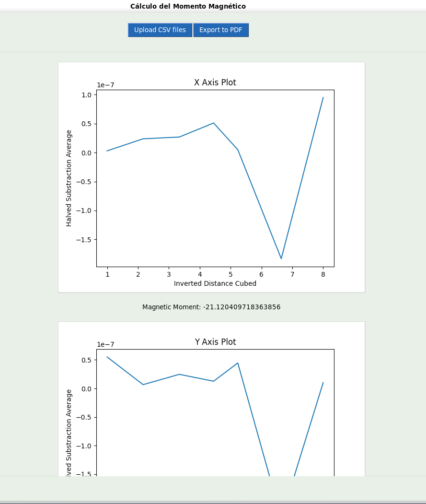
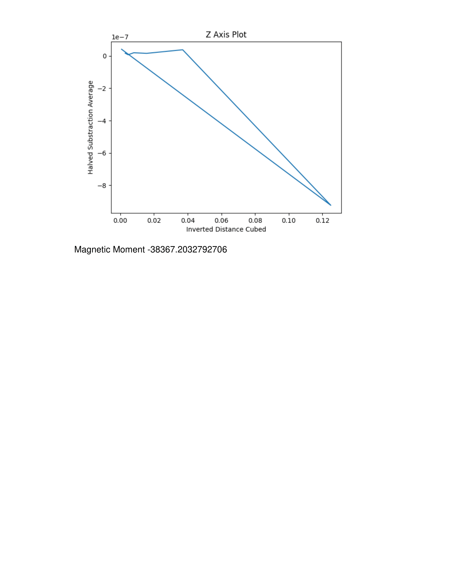
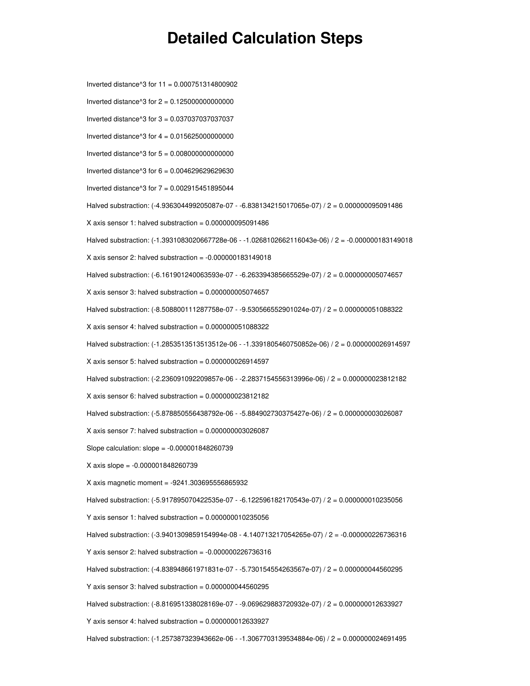
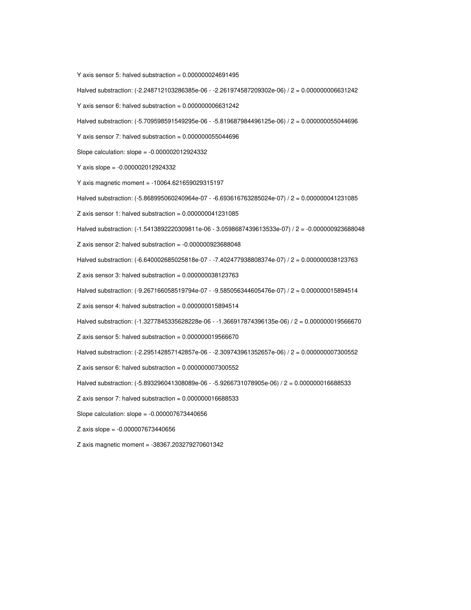

# User Manual

Once you have started the program, click the 'Upload CSV files' button.

After clicked the button, you must select six csv files: Xmas.csv, Xmenos.csv, Ymas.csv, Ymenos.csv, Zmas.csv, Zmenos.csv

Next, enter the distances in meters for each sensor.

Finally, a screen will display the graphs and the final result of the magnetic moment. On this screen a button will be enabled to export the data to a PDF file.

The PDF will contain the graphs, the final result of the magnetic moment and a step-by-step description of the operations performed to obtain the magnetic moment for each axis on the last page

